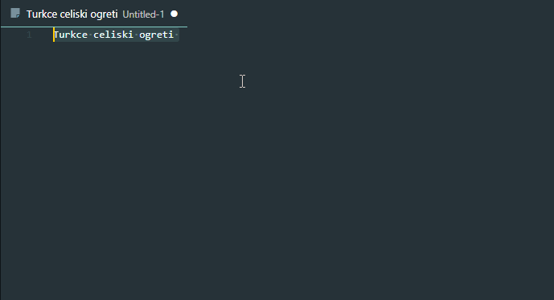
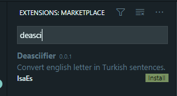

# Deasciifier

VSCode extension for deasciifiy turkish characters in vscode. If you write turkish document with an english keyboard in vscode you can easily change characters with this extension.

## Features

Commands could be accessed through the command bar (ctrl+p). Or via shortcuts.

1. Convert Ascii to Turkish Characters (ctrl+alt+d)

    

2. Convert Turkish Characters to Ascii (ctrl+alt+a)

## Installation

You can install from vscode market place by searchinf deasciifier.
    

## Acknowledgements

Main work [deasciifer](https://github.com/meacer/deasciifier)

## Release Notes

### 0.0.1

* First release.
